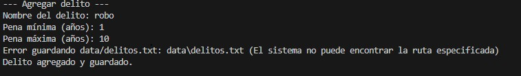
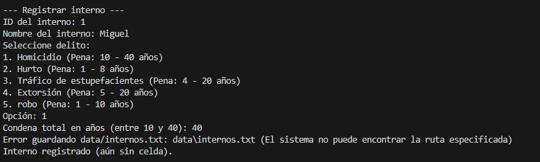
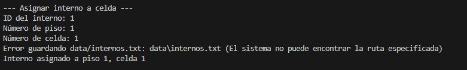
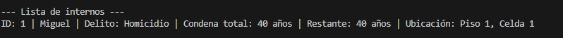
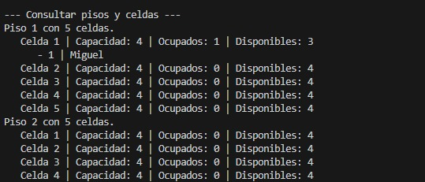
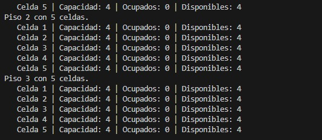
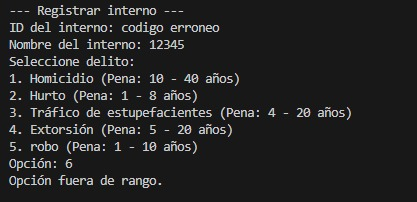
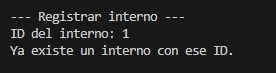

# Sistema de Administración de Cárcel - Cárcel Modelo de Ocaña

Proyecto de Programación 2 en Java, basado en consola, con persistencia en archivos de texto.

## Estructura del proyecto

- `src/domain`: Clases de dominio (Delito, Interno, Celda, Piso).
- `src/service`: Lógica del sistema y punto de entrada (`SistemaCarcel`).
- `data/delitos.txt`: Lista de delitos persistidos.
- `data/internos.txt`: Lista de internos persistidos, incluyendo ubicación.

## Compilación y ejecución

Desde la carpeta raíz del proyecto:

```bash
javac -d bin -sourcepath src src/domain/*.java src/service/*.java
java -cp bin service.SistemaCarcel
```

> Asegúrate de que la carpeta `data/` exista en la misma ruta desde donde ejecutas el programa.

## RESUMEN
El sistema del centro penitenciario permite registrar y administrar la información de los internos, guardias y celdas, así como gestionar las actividades asignadas dentro del penal. Los usuarios pueden crear, consultar, actualizar y eliminar registros de internos, asignar celdas disponibles, registrar guardias, vincular internos a actividades autorizadas y llevar control del estado de cada uno. El sistema valida que no existan datos vacíos, que las celdas no excedan su capacidad y que los internos no puedan asignarse a múltiples actividades incompatibles. También permite generar reportes básicos de los internos registrados, su celda, su actividad asignada y su situación actual. Una vez almacenados los datos, estos quedan registrados en archivos locales para garantizar persistencia y evitar pérdida de información. El sistema no gestiona seguridad física ni procesos judiciales; su alcance se limita al registro, control y consulta de internos, guardias, celdas y actividades dentro del establecimiento.

## REQUERIMIENTOS

RF1. Registrar un delito — Permitir crear un nuevo delito (nombre, código, gravedad u otros campos si aplica).

RF2. Registrar un interno — Registrar una persona privada de libertad: nombre, documento/id, delito(s), datos personales.

RF3. Registrar ubicación de interno: celda / piso — Asociar un interno a una celda dentro de un piso.

RF4. Crear celdas y pisos — Poder definir celdas, pisos, con su capacidad, características.

RF5. Asignar interno a celda — Al registrar o al reubicar, asignar interno a una celda disponible, respetando capacidad.

RF6. Cambiar estado / ubicación del interno — Permitir trasladar internos entre celdas/pisos o actualizar su estado.

RF7. Listar internos — Mostrar un listado de todos los internos, con su información relevante (delito, celda, piso, estado).

RF8. Listar celdas / pisos — Mostrar celdas/pisos con sus internos asignados, capacidad libre, etc.

RF9. Persistir datos — Leer y escribir los datos de internos y delitos en los archivos correspondientes (internos.txt, delitos.txt) para mantener la información entre ejecuciones.

RF10. Flujo de ejecución — El sistema inicia leyendo los archivos de datos; luego permite al usuario usar menú para registrar, consultar, modificar; al salir guarda los datos.

## CRITERIOS DE ACEPTACIÓN 

CA1. Registro de delito

Dado que el usuario ingresa nombre (y otros campos) del delito y estos son válidos, cuando confirma, el delito se almacena correctamente.

Si los campos obligatorios del delito están vacíos, el sistema no permite continuar.

CA2. Registro de interno
Dado un delito válido y datos personales válidos del interno, cuando crea un nuevo interno,
éste se registra con éxito y aparece en la lista de internos.
Si falta algún campo obligatorio o el documento ya existe, se rechaza el registro.

CA3. Asignar interno a celda
Dado un interno y una celda con espacio disponible, cuando se asigna, la celda refleja que
tiene un nuevo interno, y el interno está asociado a esa celda.
Si la celda está llena, la asignación es rechazada.

CA4. Listar internos
Dado que hay internos registrados, cuando el usuario solicita “listar internos”, el sistema
muestra todos con sus datos: nombre, documento, delito, celda, piso.

CA5. Listar celdas/pisos
Dado que hay celdas/pisos definidos con internos asignados, cuando se solicita “listar
celdas/pisos”, el sistema muestra celdas, su capacidad, internos asignados.

CA6. Validaciones de entrada
Si el usuario ingresa datos inválidos (campos vacíos, ids inválidos, celda llena, delito
inexistente), el sistema debe rechazar la operación y mostrar mensaje de error.

CA7. No duplicar internos
Dado un documento existente, si se intenta registrar otro interno con el mismo documento,
el sistema lo rechaza.


## PRUEBAS CRITERIOS DE ACEPTACIÓN 
CA1: 
CA2: 
CA3: 
CA4: 
CA5: 
CA5: 
CA6: 
CA7: 

## REGLAS DE COMPILACIÓN 

RN1. Todo interno debe tener al menos un delito válido asignado.

RN2. Una celda tiene una capacidad máxima de internos. No se puede asignar más internos de los permitidos.

RN3. No se permiten internos duplicados (mismo documento/id).

RN4. Los datos de internos y delitos deben persistirse siempre en los archivos data/.

RN5. Cada interno registrado debe tener una ubicación (celda / piso); no puede existir interno “flotante” sin celda.

RN6. Si se cambia la ubicación de un interno, debe actualizarse en persistencia y reflejarse en la estructura de celdas/pisos.

RN7. No se pueden eliminar datos de internos o delitos (o si se permite, debe mostrar confirmación).

RN8. El sistema debe validar que todos los datos ingresados sean completos y consistentes: por ejemplo, un delito solicitado para asignar al interno debe existir en la lista de delitos.

RN9. El flujo mínimo debe ser: cargar datos → permitir operaciones → guardar datos.

## ARQUITECTURA

EisamenFinal/
 ├── src/
 │    ├── domain/         ← clases de dominio: Delito, Interno, Celda, Piso, etc.  
 │    └── service/        ← lógica del sistema y clase principal (SistemaCarcel)  
 ├── data/                ← archivos de persistencia: delitos.txt, internos.txt, etc.  
 ├── bin/                 ← clases compiladas (generadas al compilar)  
 └── README.md            ← documentación del proyecto, instrucciones de compilación/ejecución  


## DIAGRAMA UML


